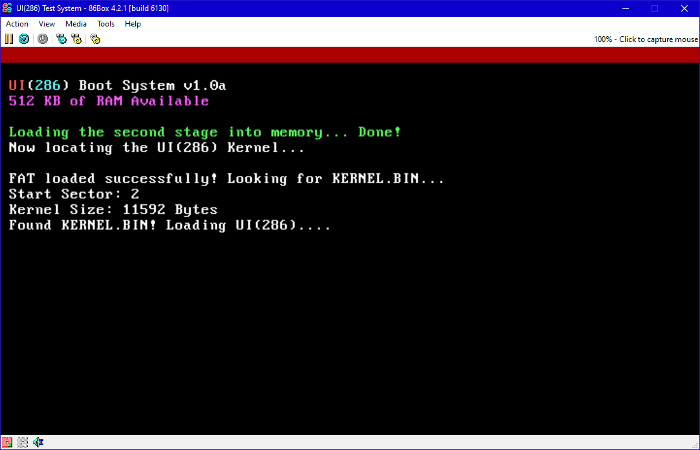
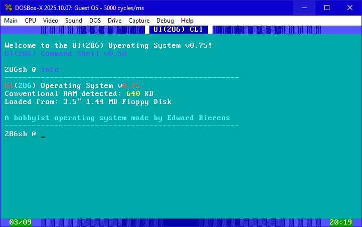
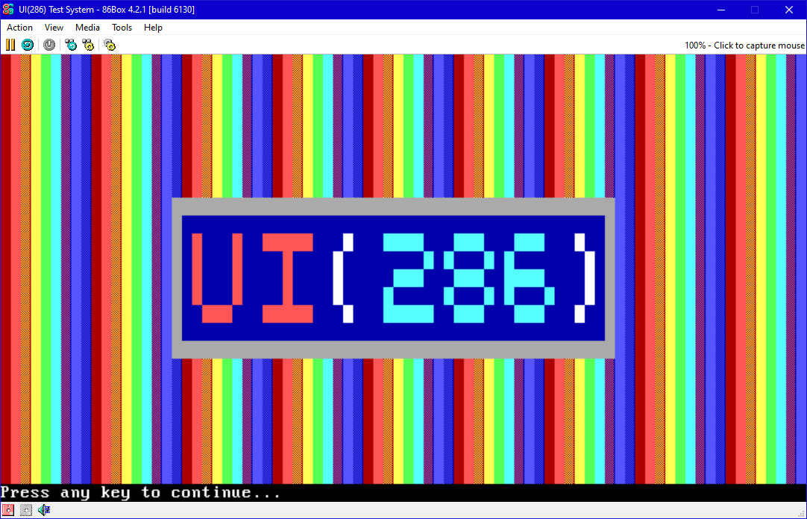
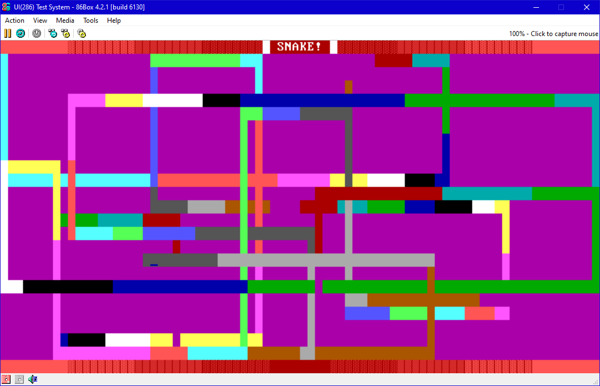

# UI-286-Operating-System

This is a simple operating system for some of the oldest PCs with 286 and 8088 processors that have long since been dropped by modern operating systems. It is less of a system to replace your workstation and moreso a demonstration of what older computers can still do in the modern day with the right technical knowhow. While it is not intended to be a UNIX-like system, many commands will be more familiar to said systems such as the `ls` and `rm` commands for example, though the `creat` command has been modified to be `create` instead. 

## Installation Steps

I have provided the instructions to create the disk image for UI(286) within the `make.bat` file. Windows users that have OpenWatcom and NASM installed and placed in their path may run this file to automatically generate a floppy disk image, HOWEVER make.bat must be supplied one of the three values for `floppy` in the format `.\make.bat <floppy>`:

- `360` for a 5.25" 360 KB Floppy Disk
- `1200` for a 5.25" 1.2 MB Floppy Disk
- `1440` for a 3.5" 1.44 MB Floppy Disk

The generated `kernel.bin` file must then be the first file placed within the floppy disk image `boot.img`, which can be done with a program such as UltraISO. Other files including file and programs may be added as necessary after `kernel.bin` is added.

## Commands Implemented

UI(286) will have 7 commands available in the CLI:

- `clear` to clear the CLI window
- `ls` to get a list of all of the files
- `create <file>` makes a file
- `rm <file>` deletes a file
- `print [sentence]` takes the input afterwards and prints it to the screen
- `info` displays basic system information
- `help` brings up the list of commands

These were mainly based off of the commands in UNIX, but some have been slightly modified to make more sense to the user.

## Applications

UI(286) has three example applications:
- `SNAKE.286` is a simple snake game that actually just lets you draw on the screen. The controls are:
    - W, A, S, and D for keyboard controls
    - Space Bar to pause
    - C to change color of snake
    - Control + X to exit the game and go back to the CLI
- `TEXT.286` is an incredibly basic text editor to display and type text.
    - Use the Enter key for a new line
    - Control + X exits the software
    - NOTE: This software is still in development; scrolling and saving functionality does NOT work right now!
- `DEMO.286` is a basic piece of software that demonstrates the sound and graphics capabilities of UI(286).

## The UI(286) Graphical User Interface
This is still very much into development, but the UI(286) operating system is intended to have a Graphical User Interface rather than just a command line. As of now, `GUI.286` only displays a rainbow on the screen for 3 seconds before automatically exiting.

## Known Issues

- TEXT.286 is still in development; scrolling and saving functionality do NOT work right now.
- Trying to enter in an unknown command or an app immediately after UI(286) boots up causes a crash.
- (5.25" 360 KB Floppy Disk only) Cannot load apps properly; algorithm for loading sectors is different than on 1.2 MB and 1.44 MB disks.
- GUI.286 is also still early in development; it does not do much at the moment aside from changing video mode.

## Official Website
An official website now exists, albeit it still in development! You can check it out at this link: http://www.eddiescomputinglab.us/ui286

## Credits

This project would have not been possible without the sound advice given by OSDev.org @ https://wiki.osdev.org/Expanded_Main_Page.

For an in-depth guide as to how different computer components work, the book *The Indispensable PC Hardware Book* by Hans-Peter Messmer is an extremely helpful resource. The edition used in UI(286) development is the 1994 edition.

Closer to the end of Command Line Interface development, the book *Assembly Language for Intel-Based Computers* by Kip R. Irvine also turned out to be a good guide to use as an alternative to the previous reference (and provides a nice IBM PC ASCII character set in the back). Fifth Edition was used.

Two good resources for navigating OpenWatcom's C Compiler and Linker can be found here:
- OpenWatcom's C Documentation @ https://open-watcom.github.io/open-watcom-v2-wikidocs/clr.html
- A guide to memory models in Watcom @ https://users.pja.edu.pl/~jms/qnx/help/watcom/compiler16/wmodels.html#16BitDataModels

Special thanks to the following pieces of software for emulating and debugging UI(286):

- 86Box @ https://86box.net/ for providing a close-to-authentic emulator for potential machines
- DOSBox-X @ https://dosbox-x.com/ for providing the debugging tools to solve issues
- Ultra ISO @ https://www.ultraiso.com/ for quick and easy access to manipulating the file system on virtual floppy disks

## Inspirations

I want to give a list of projects I saw online that inspired me to program older computers and UI(286); please give these people a look, as they have accomplished works that are nothing short of incredible!

- 8088 Domination by Hornet/Trixter/Jim Leonard @ https://trixter.oldskool.org/2014/06/17/8088-domination/
- 8088 MPH by Hornet/Trixter/Jim Leonard, CRTC, and Desire @ https://trixter.oldskool.org/2015/04/07/8088-mph-we-break-all-your-emulators/
- osakaOS by pac-ac @ https://github.com/pac-ac/osakaOS
- KolibriOS by the KolibriOS Project Team @ http://kolibrios.org/en/

## Previews

